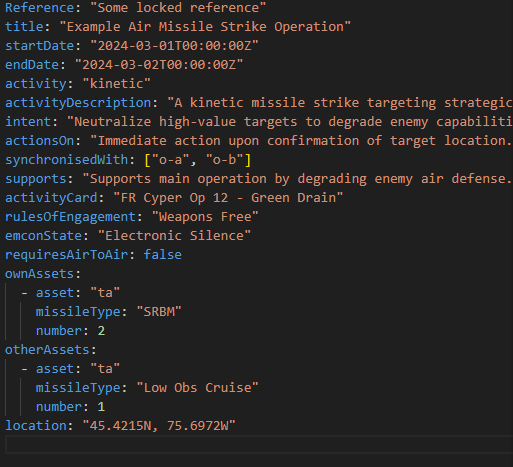
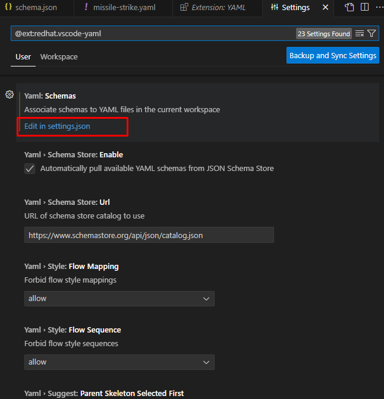
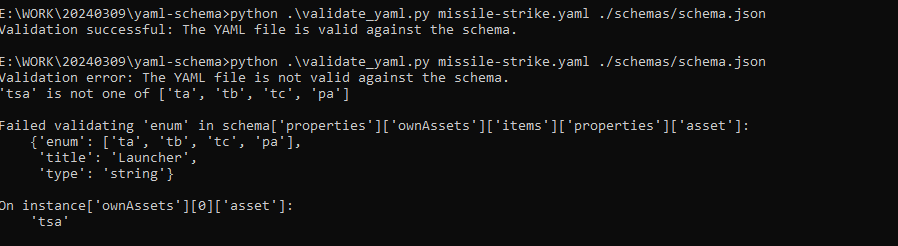

# yaml-schema

Demonstrator for schema-controlled editing of YAML documents in VS-code

## 1. Create the schema

From a previous project we have this JSON schema:


One thing important is that some of properties like propertyOrder will be ignored in new schema json.

The full documentation of JSON-schema is here: https://json-schema.org/

## 2. Let a YAML file declare schema to use

Create the yaml data matching the `missile.schema.json`:



Adding this line to the start of the file associates it with that schema, to assist in developing the document - including validation.

```yaml
# yaml-language-server: $schema=schemas/schema.json
```

## 3. Configure VS-Code to associate filename patterns with schemas.

Another way is to specify this association in settings.json, for the YAML extension.

First, install the `YAML` extension:


Second, configure `YAML` extension settings:


And then go to settings.json (note: this can be at the user level or at the workspace level. For the latter, put the `settings.json` into a `vscode` folder in the workspace root folder).



In `settings.json` define `yaml.schemas`

```json
{
  "workbench.colorTheme": "Default Dark Modern",
  "editor.formatOnSave": true,
  "editor.defaultFormatter": "esbenp.prettier-vscode",
  "editor.tabSize": 2,
  "git.confirmSync": false,
  "git.enableSmartCommit": true,
  "explorer.confirmDelete": false,
  "javascript.updateImportsOnFileMove.enabled": "never",
  "explorer.confirmDragAndDrop": false,
  "redhat.telemetry.enabled": true,
  "yaml.format.singleQuote": true,
  // define schema of yaml file
  "yaml.schemas": {
    "./schemas/missile.schema.json": "*.missile.yaml",
    "./schemas/tank.schema.json": "*.tank.yaml"
  }
  //
}
```

## 4. Validate the yaml file using python

1. pip install pyyaml
2. pip install jsonschema

python .\validate_yaml.py [`yaml file`] [`schema json file`]

```shell
python .\validate_yaml.py missile-strike.yaml ./schemas/schema.json
```



